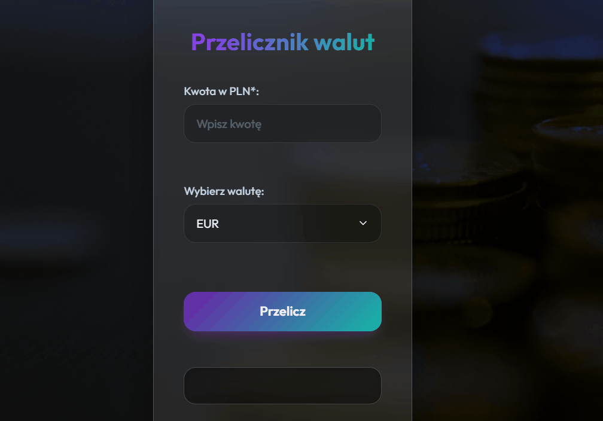

# Currency-converter-react

## Demo

https://marcinkgit1.github.io/currency-converter-react/

### Description

A modern, responsive currency converter application built with React. The app allows you to convert Polish Zloty (PLN) to USD, EUR, GBP, and CHF. Currency rates are dynamically downloaded from the [currencyapi.com](https://currencyapi.com/) API. 

The application features a sleek, dark-mode Glassmorphism UI, real-time clock, and handles loading and error states gracefully.

### Preview



### Technologies used:

- React (Hooks: `useState`, `useEffect`, Custom Hooks)
- HTML & Modern CSS (Glassmorphism, Gradients)
- JavaScript ES6+
- Configured with `react-scripts`
- Styled-Components for component-scoped styling
- Google Fonts (Outfit)

---

## 🔒 Setup & Authentication (Important)

To run this project locally, you must provide your own API key for the currency rates. The codebase expects this key to be injected via environment variables.

1. Get a free API key from [currencyapi.com](https://currencyapi.com/).
2. Create a file named `.env` in the root directory.
3. Add your key like this:
   ```env
   REACT_APP_CURRENCY_API_KEY=your_api_key_here
   ```
4. **Never commit the `.env` file to version control.** It is already added to `.gitignore`.

---

## Available Scripts

In the project directory, you can run:

### `npm install`
Installs all required dependencies (including `react-scripts`). **Run this first!**

### `npm start` or `npm run dev`
Runs the app in development mode.
Open [http://localhost:3000](http://localhost:3000) to view it in your browser. The page will reload when you make changes.

### `npm test`
Launches the test runner in the interactive watch mode.

### `npm run build`
Builds the app for production to the `build` folder. It correctly bundles React in production mode and optimizes the build for the best performance.

### `npm run deploy`
Automatically builds the project and deploys it to the `gh-pages` branch for GitHub Pages hosting.
